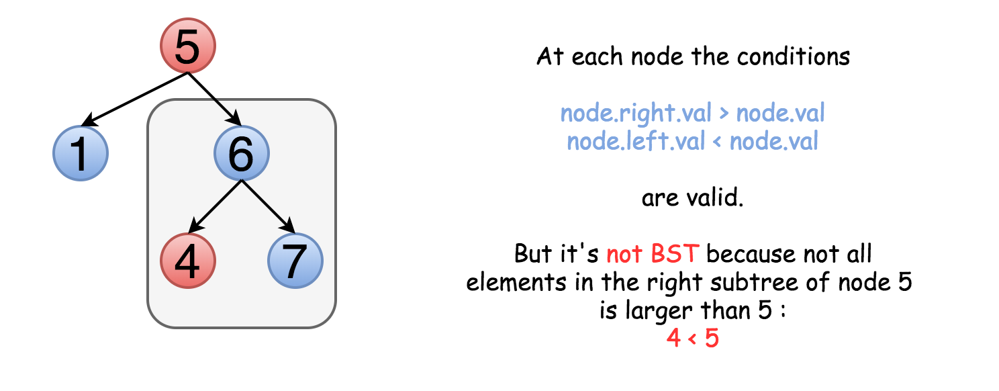

## Questions: 
https://leetcode.com/problems/validate-binary-search-tree/

## Keys
1. Binary Search Tree(BST): 
    - The left subtree of a node contains only nodes with keys less than the node's key.
    - The right subtree of a node contains only nodes with keys greater than the node's key.
    - Both the left and right subtrees must also be binary search trees.
2. The following type is not a valid BST:

## Corner Cases:
1. Null TreeNode => true;

## Solutions:
1. Iteration/Recursion
2. Inorder Traversal (+ Stack)
    - Traversal:
        

#### Related problems:
[94. Binary Tree Inorder Traversal](https://leetcode.com/problems/binary-tree-inorder-traversal/)
